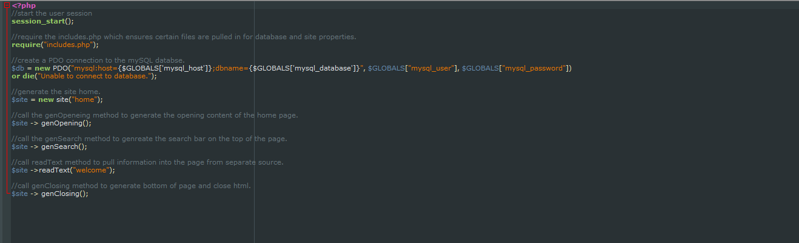
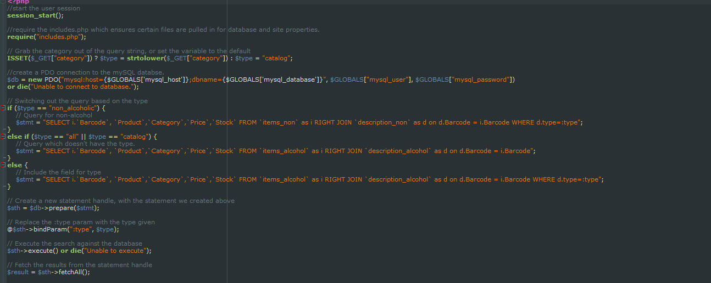
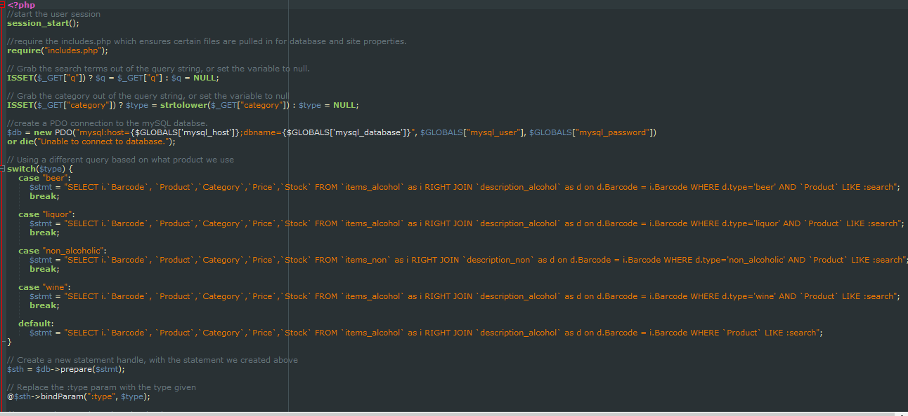
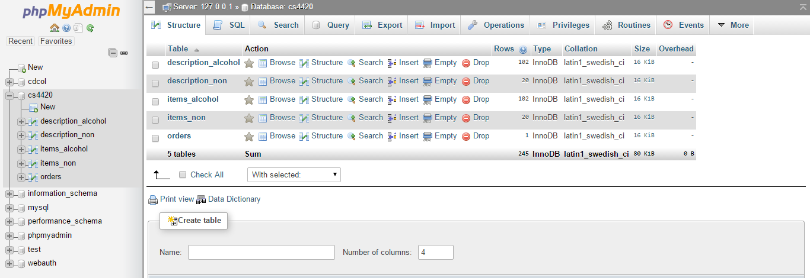
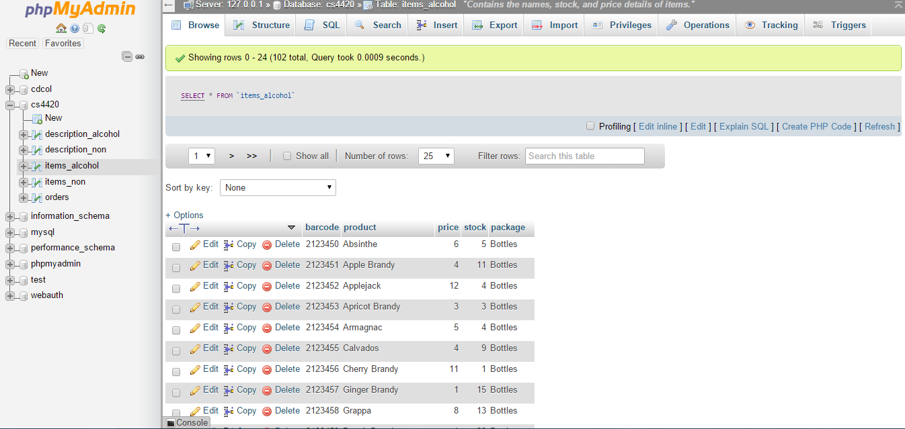
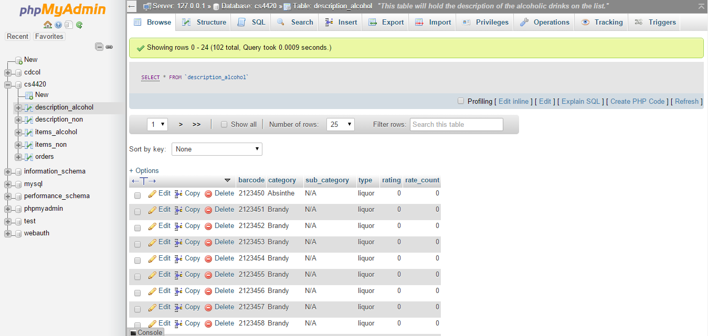
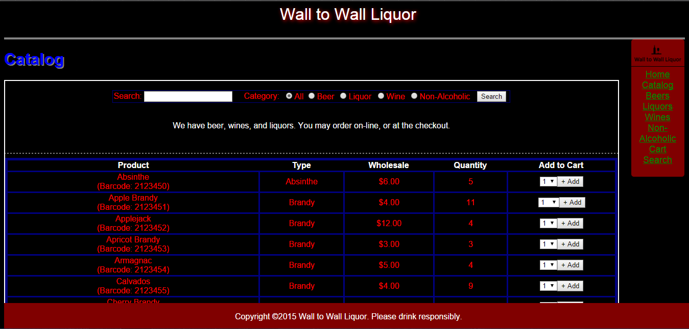
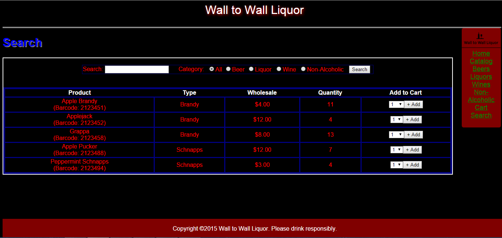
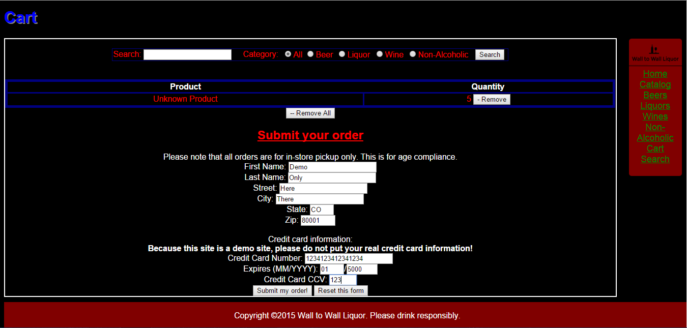

#CS4420#
This repository contains a class project for CS4420 - "Database systems I."  Our group was "Team 4." Team members were Cynthia, Matthew, and Klint.

## About ##
This project is a website for a theoretical alcohol store called "Wall to Wall Liquor."

##Goals##
The goal of this project was to demonstrate our knowledge of databases in the "real word," creating a system which is powered by a database.

##Installation of this tool##

###Assumptions ###
We are assuming you have the following:
- Web server running a recent stable version of PHP (PHP 7 has not been tested at this time)
- Database server where you can create a database
- The two servers above can talk.

###Steps###
1. Download the lastest stable version from [https://github.com/klinthammel/CS4420/releases](https://github.com/klinthammel/CS4420/releases).
2. Unzip the source code archive.
3. Create a database to store the data.
4. Execute sql/full_database.sql against the database you just created.
5. Copy the rest of the archive to the web server.
6. Copy vars/config.inc.sample.php to vars/config.inc.php.
7. Open vars/conf.inc.php and modify the values according to the comments in the file.
8. Start your web server, and open the site in your web browser.

##Screenshots##
###Code###

Screen grab of code for the index page. Index page is the first thing user sees.

Screen grab of code for the catalog page. This code it utilized to show the various categories.

Screen grab of code for the search function of the page. Uses a switch statement for the category selections.

###Database###

Screen grab of the database and all the tables it has.

Screen grab of a data table within the database.

Screen grab of a data table within the database that can/will be linked with another table.

###Webpage###

Screen grab of catalog page. Shows everything in alcoholic database.

Screen grab of search page. Results are of items similar to searched term. Can choose from categories.

Screen grab of cart page. From here you can edit cart or checkout.

